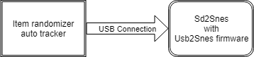
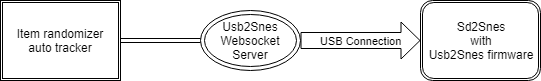

Welcome to QUsb2Snes documentation.

QUsb2Snes is a reimplementation of the Usb2Snes websocket server using a more multi plateform framework (Qt, ench the Q in the name) than the original one.

# Contents
{:.no_toc}

* TOC
{:toc}

# Origin

## Usb2Snes firmware

To make more thing more clear of what is exactly QUsb2Snes, let's get back to the origin of the Usb2Snes project.

Usb2Snes is a firmware for the Sd2snes cartridge written by Redguyy that allows to use the USB port on the Sd2Snes to access various fonctionnality of the Sd2Snes. Most notable are uploading ROM, read and write various memories of the console.

The issue with this approche, when writing application that use this techology only one application can have access to the Sd2snes. So for example you cannot run an Item tracker for alttp randomizer at the same time than the fileviewer to upload a new ROM.

To avoid this issue, Redguyy wrote an intermediary application also called Usb2Snes (enjoy your name confusion) that other application use to talk to the Sd2Snes.

So a basic usage look like that:

## Emulators, SNES Classic...

QUsb2Snes is a replacement for the middle part of the previous diagram. Since now the application
does not access directly the Sd2Snes through the Usb connection. Nothing prevent this intermediate part to trick the applications to make them access something else, like a Snes Emulator or a SNES Classic

For example Snes9x

# Support

QUsb2Snes currently support:

* SD2Snes with the [usb2snes](https://github.com/RedGuyyyy/sd2snes/releases) firmware.
* [Snes9x multitroid](https://drive.google.com/open?id=1_ej-pwWtCAHYXIrvs5Hro16A1s9Hi3Jz) with Lua support
* SNES classic moded with [Hakchi2 CE](https://github.com/TeamShinkansen/hakchi2/releases)
* RetroArch support with Snes9x and bsnes-mercury cores

# Application

A list of applications and what they do is available on the [application page](https://skarsnik.github.io/QUsb2snes/Application)

# Magic2Snes

Magic2Snes is a special application that make writing applications for Usb2Snes easier for non developpers. You will find more informations on [Magic2Snes](https://github.com/Skarsnik/Magic2snes/wiki)

By default QUsb2Snes comes with various Magic2Snes scripts.

# Installation

## Windows

* Download the lastest release on the [release page](https://github.com/Skarsnik/QUsb2snes/releases)
* Uncompress the 7zip file and start the QUsb2Snes executable

## Mac os X

Mac os X release comming soon (tm)

## Linux

For now you will have to compile the source yourself, see the `LinuxREADME.md` file to how to do it.

# Usage

If you don't use a SD2Snes, you will have to activate the support for your way to play SNES in the `devices` menu.

## SD2Snes

You need to install the last Usb2Snes firmware by redguy (https://github.com/RedGuyyyy/sd2snes/releases/tag/v7) . Just follows the instruction provided. Don't start usb2snes.exe since QUsb2snes do the same thing that the original software. Your sd2snes device should show up on the Devices menu when connected.

## SNES9x multitroid

Multitroid provide a patched version of snes9x with a lua script that allow for external software to communicate with it. Get the emulator on http://multitroid.com/. Activate the snes9x bridge on the device menu of QUsb2Snes then run the multibridge.lua scripts on snes9x.

## RetroArch

You need to use etheir `Snex9x` core or one of the `bsnes-mercury` and edit your retroarch.cfg file (can be found in %appData%\RetroArch) to set `network_cmd_enable = "true"` to true (default is false). Then you need to activate the RetroArch virtual device on the devices menu.

Snex9x core :  needing to the patch the ROM (multitroid for example) you etheir need to patch the rom manually with the IPS file or put the IPS file along side the rom with the same name for retroarch to auto patch it.

You can connect to a remote RetroArch by adding a RetroArchHost=YourOwnHost in the config.ini file

## SNES classic (called also SNES mini)

Mainly tested with Super Metroid.

Enable the SNES classic support on the device menu.

You need to 'hack' your SNES classic with the Hakchi2 CE version (https://github.com/TeamShinkansen/hakchi2/releases/) then remove the covershell mod (as explained in https://github.com/TeamShinkansen/hakchi2/releases/tag/v3.4.0). Install the `serverstuff` mod provided by QUsb2snes: copy the `serverstuff.hmod` to the user_mods directory on Hakchi2CE, then install the mod with Hakchi2 Start the game and check if the SNES classic appear on the Devices menu, it should display SNES classic : no client connected. If not, try restarting the game.

It will not work with the 'normal' hakchi2 version as the Hakchi2 CE provide a more stable way to access the SNES Classic.
